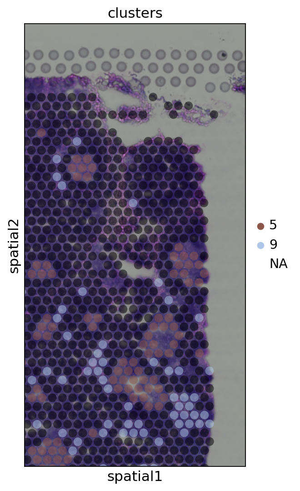

# 01 — Basic Scanpy Spatial Analysis

## Overview
This notebook introduces the foundational spatial transcriptomics workflow using **Scanpy** on a **Human Lymph Node Visium** dataset. It covers everything from raw data loading and quality control through to clustering, marker gene identification, and spatial visualization.

**Dataset:** 10x Genomics Human Lymph Node (Visium)  
**Platform:** Google Colab  
**Key Libraries:** `scanpy`, `squidpy`, `leidenalg`, `igraph`

---

## Workflow

### 1. Quality Control
Histograms of total UMI counts and number of genes detected per spot. Spots with very low counts or gene detection are filtered out before downstream analysis.


---

### 2. Dimensionality Reduction & Clustering
After normalization and PCA, UMAP is used to embed spots in 2D. Leiden clustering assigns each spot to a cluster based on its transcriptional profile.


---

### 3. Spatial Visualization — Total Counts
Total UMI counts per spot projected back onto the tissue section, giving a sense of tissue quality and RNA capture efficiency across the slide.


---

### 4. Spatial Cluster Overlay
Leiden clusters overlaid on the H&E tissue image, revealing how transcriptionally distinct populations map to anatomical compartments of the lymph node.




---

### 5. Marker Gene Heatmap
Top 10 differentially expressed marker genes per cluster, visualized as a heatmap. This helps characterize the biological identity of each cluster (e.g., B cell zones, T cell zones, stromal regions).


---

### 6. Spatial Expression of Specific Genes
Spatial expression of biologically relevant genes mapped onto the tissue:

- **CR2** — Complement receptor 2, a B cell marker
- **COL1A2** & **SYPL1** — Stromal/fibroblast markers


---

## Key Concepts
| Concept | Description |
|---|---|
| Visium spot | 55 µm capture area; captures transcripts from multiple cells |
| Leiden clustering | Graph-based community detection on the k-NN graph |
| UMAP | Non-linear dimensionality reduction for visualization |
| Marker genes | Genes statistically enriched in one cluster vs. all others |

## Dependencies
```bash
pip install scanpy squidpy igraph leidenalg
```
