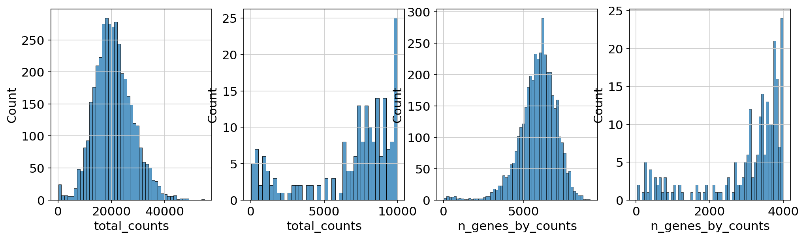
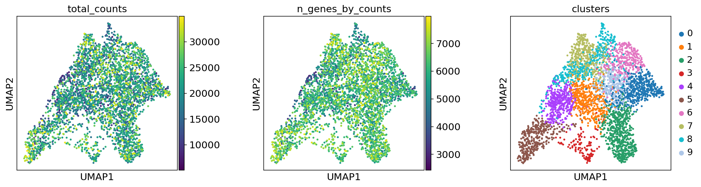
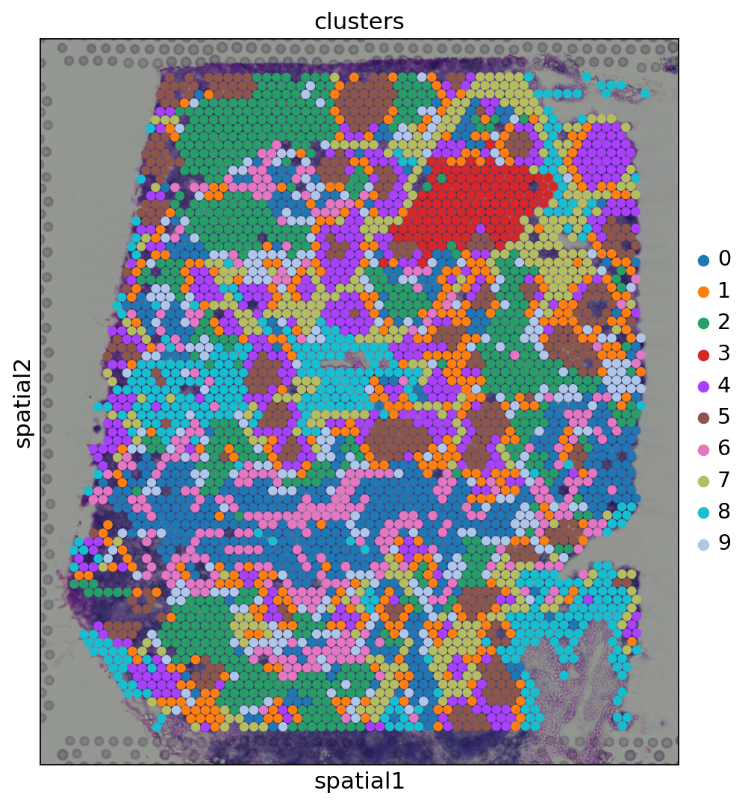
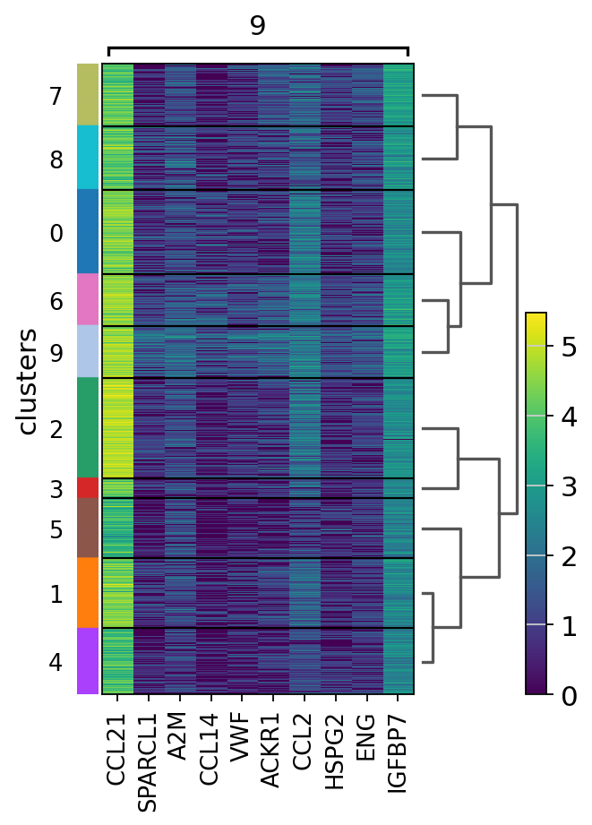
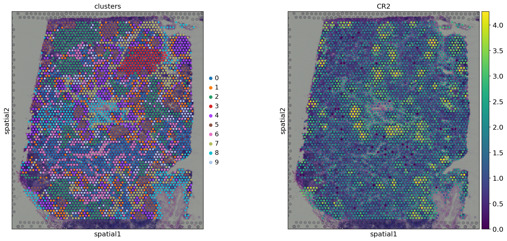
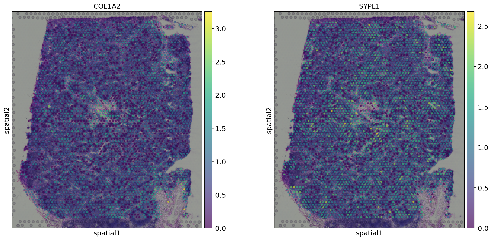
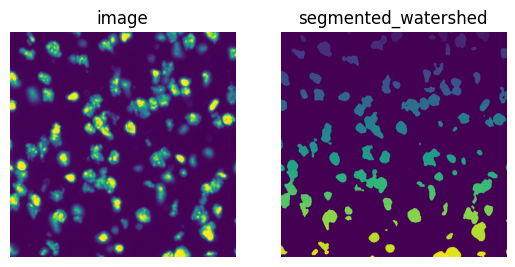
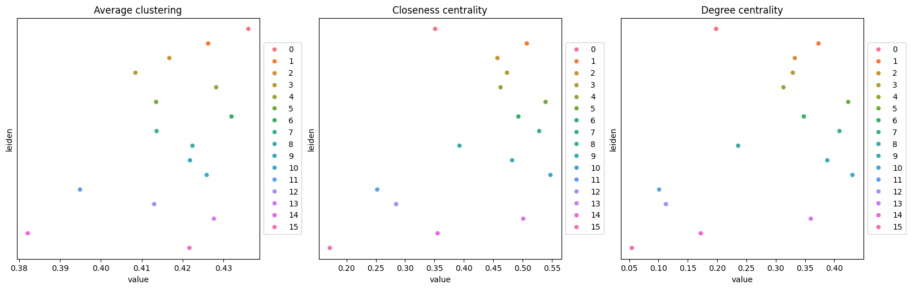
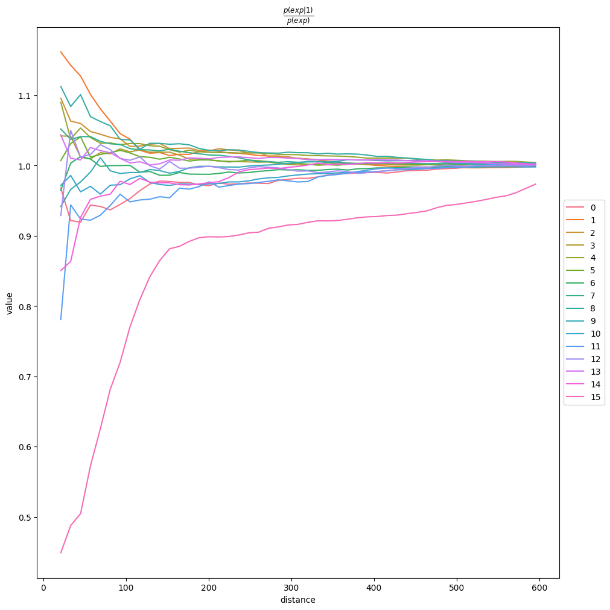
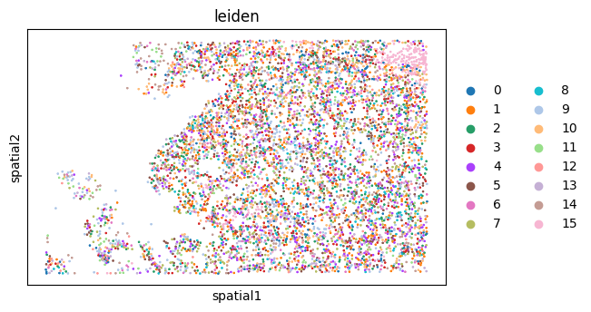

Spatial Transcriptomics Analysis using Scanpy & Squidpy
> **Course:** Bioinformatics | **Level:** Undergraduate
> **Author:** Pukhraj Tahir
> **Tools:** Scanpy · Squidpy · spatialdata · scikit-image · Python 3
> **Platform:** Google Colab (all notebooks run end-to-end with free tier)
---
Table of Contents
Project Overview
Scientific Background
Repository Structure
Notebooks & Results
Methods Summary
Technology Stack
Key Biological Concepts
Installation & Reproducibility
Learning Outcomes
References
---
Project Overview
This repository presents a complete, progressive analysis pipeline for spatial transcriptomics data — a cutting-edge genomics technology that measures gene expression while preserving the physical location of cells within tissue. Four Jupyter notebooks are implemented, each building on the last, covering:
Standard quality control and clustering of Visium data
Fluorescence image segmentation and multi-modal feature extraction
Spatial statistics and cell-cell communication inference
Single-cell resolution analysis of a human cancer biopsy using Xenium
All analyses use publicly available 10x Genomics datasets and are fully reproducible on Google Colab with no local compute required.
---
Scientific Background
Why Spatial Transcriptomics?
Traditional single-cell RNA sequencing (scRNA-seq) dissociates tissue into individual cells, losing all spatial context. This is a critical limitation because cell identity and function are deeply influenced by location — a neuron in the hippocampus behaves differently from one in the cortex, even if their transcriptomes look similar in isolation.
Spatial transcriptomics resolves this by measuring gene expression in situ — directly within intact tissue sections — allowing us to ask:
Which cell types occupy which anatomical regions?
Which cell populations physically interact and potentially communicate?
Are specific genes spatially clustered, or randomly distributed?
Technologies Used
Platform	Resolution	How It Works
10x Visium	~55 µm spots (multi-cell)	Barcoded capture array; each spot captures mRNA from ~1–10 cells
10x Xenium	Single-cell / sub-cellular	In situ hybridization; detects individual transcripts with fluorescent probes
Visium is currently the most widely adopted platform in the field; Xenium represents the next generation with true single-cell spatial resolution.
---
Repository Structure
```
Spatial-Transcriptomics-/
├── 01_scanpy_basic/
│   ├── notebook.ipynb       # Foundational Visium workflow
│   ├── README.md            # Detailed notebook documentation
│   └── results/             # All output figures (8 plots)
│       ├── qc_histograms.png
│       ├── umap_clusters.png
│       ├── spatial_counts.png
│       ├── spatial_clusters.png
│       ├── spatial_clusters_zoom.png
│       ├── marker_genes_heatmap.png
│       ├── spatial_cr2.png
│       └── spatial_col1a2_sypl1.png
├── 02_squidpy_visium_fluo/
│   ├── notebook.ipynb       # Image segmentation & feature extraction
│   ├── README.md
│   └── results/             # 3 plots
│       ├── spatial_clusters.png
│       ├── segmentation_comparison.png
│       └── image_features_vs_clusters.png
├── 03_squidpy_visium_hne/
│   ├── notebook.ipynb       # Spatial statistics & ligand-receptor analysis
│   ├── README.md
│   └── results/             # 4 plots
│       ├── spatial_clusters.png
│       ├── neighborhood_enrichment.png
│       ├── co_occurrence_hippocampus.png
│       └── ligrec_plot.png
├── 04_squidpy_xenium/
│   ├── notebook.ipynb       # Single-cell resolution Xenium analysis
│   ├── README.md
│   └── results/             # 3 plots
│       ├── centrality_scores.png
│       ├── co_occurrence.png
│       └── spatial_clusters.png
├── LICENSE
└── README.md
```
---
Notebooks & Results
Notebook 01 — Basic Scanpy Spatial Analysis
Dataset: Human Lymph Node · 10x Visium · H&E stained
Biological Question: Can we identify distinct immune cell populations in a human lymph node and map them to their spatial locations?
The lymph node is a secondary lymphoid organ containing spatially organized B cell follicles, T cell zones, and stromal compartments. Visium allows us to resolve these zones transcriptomically.
Pipeline:
Load Visium data (gene expression matrix + H&E image)
Quality control: filter spots with low UMI counts or gene detection
Normalize → log-transform → highly variable gene selection → PCA
Construct k-nearest neighbor graph → Leiden clustering → UMAP
Identify marker genes per cluster (Wilcoxon rank-sum test)
Visualize gene expression spatially
Key Results:
QC metrics confirm high-quality capture across the tissue section:

UMAP embedding reveals transcriptionally distinct cell populations:

Leiden clusters overlaid on H&E tissue — B cell follicles, T cell zones and stromal regions are spatially segregated:

Marker gene heatmap — each cluster shows a unique transcriptional signature enabling biological annotation:

Spatial expression of CR2 (B cell marker) and COL1A2/SYPL1 (stromal markers) confirms cluster identities:


---
Notebook 02 — Visium Fluorescence Image Analysis
Dataset: Mouse Brain · 10x Visium · DAPI fluorescence
Biological Question: Can morphological features extracted from tissue images independently capture the same biological structure as gene expression?
DAPI (4′,6-diamidino-2-phenylindole) stains cell nuclei, enabling quantification of cell density and nuclear morphology per Visium spot. Correlating these image-derived features with RNA-based clusters reveals the degree of multi-modal concordance.
Pipeline:
Load Visium data with paired DAPI fluorescence image
Cluster spots transcriptomically (baseline)
Segment nuclei using the watershed algorithm on the DAPI channel
Extract per-spot image features (intensity statistics, texture descriptors)
Correlate image features with gene expression cluster identity
Key Results:
Transcriptomic clusters establish the biological baseline:

Watershed segmentation accurately delineates individual nuclei — each color represents a distinct segmented nucleus:

Image-derived features show strong association with transcriptomic cluster identity, demonstrating multi-modal concordance:

---
Notebook 03 — Visium H&E Spatial Statistics & Cell Communication
Dataset: Mouse Brain · 10x Visium · H&E
Biological Question: Which brain regions are spatially co-organized, and which cell populations communicate via secreted ligands?
The mouse brain has well-defined anatomical layers (Cortex, Hippocampus, Striatum, etc.) with known spatial relationships. This notebook uses statistical methods to quantify these relationships and infer intercellular signaling.
Pipeline:
Load annotated Visium data with brain region labels
Build spatial neighborhood graph (Delaunay triangulation / k-NN)
Compute neighborhood enrichment (permutation test, 1000 iterations)
Compute co-occurrence scores across spatial distance bins
Run ligand-receptor interaction analysis using the CellChat database
Key Results:
Annotated brain regions overlaid on H&E tissue:

Neighborhood enrichment heatmap — red indicates pairs that are spatially co-localized significantly more than expected by chance. The Hippocampus and adjacent cortical layers show strong enrichment, consistent with known neuroanatomy:

Co-occurrence probability of the Hippocampus cluster with all others as a function of spatial distance — sharp peaks at short distances identify tightly coupled neighboring populations:

Statistically significant ligand-receptor pairs between spatially adjacent clusters reveal potential paracrine signaling axes in the brain:

---
Notebook 04 — Xenium Single-Cell Resolution Analysis
Dataset: Human Lung Cancer · 10x Xenium · 2 FOVs · 11,898 cells · 377-gene panel
Biological Question: How are distinct cell populations organized within the tumor microenvironment, and which are spatially central vs. peripheral?
Lung cancer tumors contain a complex ecosystem of malignant cells, immune infiltrates (T cells, macrophages, NK cells), stromal fibroblasts, and endothelial cells. Xenium's single-cell resolution allows us to map these populations with unprecedented precision and apply graph-theoretic metrics to quantify their spatial roles.
Pipeline:
Load Xenium data using the `spatialdata` / `spatialdata-io` framework
Cluster cells (Leiden) on the 377-gene expression panel
Build spatial neighborhood graph at single-cell resolution
Compute centrality scores (closeness, degree, average) per cluster
Compute co-occurrence from reference cluster across distance bins
Calculate Moran's I spatial autocorrelation for gene expression
Key Results:
Centrality scores across three metrics reveal which clusters occupy spatially central hub positions in the tumor microenvironment. High closeness centrality indicates a cluster that can rapidly reach all others — likely an infiltrating immune population:

Distance-dependent co-occurrence from cluster 1 reveals which populations form tight spatial niches vs. which are randomly distributed:

Single-cell resolution spatial map of Leiden clusters — tumor cell nests, immune infiltrates, and stromal populations occupy distinct spatial territories within the lung cancer biopsy:

---
Methods Summary
Step	Method	Tool
Data loading	AnnData / SpatialData format parsing	Scanpy, spatialdata-io
Quality control	UMI count & gene detection filtering	Scanpy
Normalization	Total-count normalization + log1p	Scanpy
Dimensionality reduction	PCA (50 components) → UMAP	Scanpy
Clustering	Leiden algorithm on k-NN graph	igraph + leidenalg
Marker genes	Wilcoxon rank-sum test	Scanpy
Image segmentation	Watershed algorithm on DAPI channel	scikit-image
Image features	Intensity, texture, histogram statistics	Squidpy
Spatial graph	k-NN / Delaunay triangulation on spot coordinates	Squidpy
Neighborhood enrichment	Permutation test (1000 iterations)	Squidpy
Co-occurrence	Distance-binned probability estimation	Squidpy
Ligand-receptor	Database-matched interaction scoring	Squidpy
Centrality scores	Closeness, degree, average centrality	Squidpy
Spatial autocorrelation	Moran's I statistic	Squidpy
---
Technology Stack
Tool	Version	Role
Scanpy	≥1.9	Core single-cell analysis framework
Squidpy	≥1.3	Spatial statistics, graph construction, image analysis
spatialdata	≥0.1	Next-generation spatial omics data framework
spatialdata-io	≥0.1	Xenium / Visium data readers
spatialdata-plot	≥0.1	Visualization for spatialdata objects
scikit-image	≥0.19	Image processing and segmentation
leidenalg	≥0.9	Leiden community detection algorithm
igraph	≥0.10	Graph construction and analysis
UMAP-learn	≥0.5	Non-linear dimensionality reduction
---
Key Biological Concepts
Spatial Transcriptomics
Measures gene expression while preserving the physical location of cells/spots within intact tissue — bridging the gap between histology and genomics.
Visium vs Xenium
Visium uses a 55 µm barcoded capture array (multi-cell resolution); Xenium uses fluorescent in situ hybridization to detect individual transcripts at sub-cellular resolution.
Leiden Clustering
A graph-based community detection algorithm that identifies groups of transcriptionally similar cells by optimizing modularity on the k-nearest neighbor graph.
Neighborhood Enrichment
A permutation test that asks whether two cell populations are spatially closer to each other than expected under a random spatial arrangement.
Co-occurrence Score
Measures the probability of finding two cluster types within the same spatial window as a function of distance, revealing spatial coupling across scales.
Moran's I
A spatial autocorrelation statistic ranging from -1 (dispersed) to +1 (clustered). High Moran's I for a gene indicates its expression is spatially organized rather than randomly distributed.
Centrality Metrics
Graph-theoretic measures applied to the spatial neighborhood graph:
Closeness centrality: How quickly a node can reach all others
Degree centrality: Number of direct neighbors (local density)
Average centrality: Mean shortest path to all other nodes
Ligand-Receptor Analysis
Pairs known secreted ligands expressed in one cluster with their cognate receptors expressed in spatially adjacent clusters, predicting putative paracrine signaling interactions.
---
Installation & Reproducibility
All notebooks are designed to run on Google Colab (free tier). Datasets are downloaded automatically within each notebook from 10x Genomics public servers.
```bash
# Notebooks 01–03 (Visium)
pip install scanpy squidpy igraph leidenalg scikit-image dask

# Notebook 04 (Xenium — additional packages)
pip install spatialdata spatialdata-io spatialdata-plot
```
To reproduce locally:
```bash
git clone https://github.com/pukhraj-tahir/Spatial-Transcriptomics-.git
cd Spatial-Transcriptomics-
pip install scanpy squidpy igraph leidenalg scikit-image dask spatialdata spatialdata-io spatialdata-plot
# Open any notebook.ipynb in Jupyter or VS Code
```
---
Learning Outcomes
Through this project, the following bioinformatics competencies were developed and demonstrated:
Data wrangling: Loading, inspecting, and preprocessing complex multi-modal spatial omics datasets in AnnData and SpatialData formats
Quality control: Applying appropriate filtering thresholds for UMI counts and gene detection to remove low-quality spots/cells
Dimensionality reduction: Applying PCA and UMAP to high-dimensional gene expression matrices and interpreting the resulting embeddings
Clustering: Using graph-based Leiden clustering to identify transcriptionally distinct cell populations
Spatial analysis: Constructing spatial neighborhood graphs and applying statistical tests (neighborhood enrichment, co-occurrence, Moran's I) to quantify tissue organization
Image analysis: Performing nucleus segmentation using the watershed algorithm and extracting quantitative morphological features
Cell-cell communication: Inferring putative intercellular signaling from spatial co-localization and ligand-receptor databases
Scientific communication: Documenting analysis decisions, interpreting results in their biological context, and presenting findings clearly
---
References
Wolf, F.A., Angerer, P. & Theis, F.J. (2018). SCANPY: large-scale single-cell gene expression data analysis. Genome Biology, 19, 15.
Palla, G. et al. (2022). Squidpy: a scalable framework for spatial omics analysis. Nature Methods, 19, 171–178.
Marconato, L. et al. (2024). SpatialData: an open and universal data framework for spatial omics. Nature Methods, 21, 1600–1609.
10x Genomics Visium Technology: https://www.10xgenomics.com/products/spatial-gene-expression
10x Genomics Xenium Technology: https://www.10xgenomics.com/products/xenium-in-situ
Traag, V.A., Waltman, L. & van Eck, N.J. (2019). From Louvain to Leiden: guaranteeing well-connected communities. Scientific Reports, 9, 5233.
---
License
This project is licensed under the MIT License — see the LICENSE file for details.
